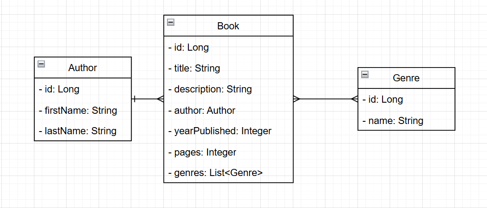

# ProfITsoft - Task 2

## Technologies
- `Spring Boot 4.0.0`
- `Spring Boot Starters JPA, Validation, Cache, Actuator`
- `PostgreSQL Database 17`
- `Liquibase`
- `Lombok`
- `MapStruct`
- `Apace POI Library`
- `Ehcache`
- `Swagger`
- `Junit 5/Mockito`
- `Zonky embedded postgresql database (in Docker container)`

## Entities



`Book` many to one `Author`

`Book` many to many `Genre`

## Endpoints

| Method   | Endpoint             | Description                                                            |
|----------|----------------------|------------------------------------------------------------------------|
| `POST`   | `/api/books`         | Create a new `Book`                                                    |
| `GET`    | `/api/books/{id}`    | Get a `Book` by its `id`                                               |
| `PUT`    | `/api/books/{id}`    | Update a `Book` by its `id`                                            |
| `DELETE` | `/api/books/{id}`    | Delete a `Book` by its `id`                                            |
| `POST`   | `/api/books/_list`   | Search for `Books` using filters (pagination + sorting supported)      |
| `POST`   | `/api/books/_report` | Search for `Books` using filters and download a generated Excel report |
| `POST`   | `/api/books/upload`  | Upload a JSON file and create all `Books` from its contents            |
| `POST`   | `/api/authors/_list` | Search for `Authors` using filters                                     |
| `GET`    | `/api/authros/{id}`  | Get a `Genre` by its `id`                                              |
| `POST`   | `/api/authors`       | Create a new `Author`                                                  |
| `PUT`    | `/api/authors/{id}`  | Update an `Author` by its `id`                                         |
| `DELETE` | `/api/authors/{id}`  | Delete an `Author` by its `id`                                         |
| `POST`   | `/api/genres/_list`  | Search for `Genres` using filters                                      |
| `GET`    | `/api/genres/{id}`   | Get a `Genre` by its `id`                                              | 
| `POST`   | `/api/genres`        | Create a new `Genre`                                                   |
| `PUT`    | `/api/genres/{id}`   | Update a `Genre` by its `id`                                           |
| `DELETE` | `/api/genres/{id}`   | Delete a `Genre` by its `id`                                           |
| `GET`    | `/actuator/health`   | Returns the server status                                              |

## Running

### 1. Create a `postgres.env` file in the project root:

This file is used by the PostgreSQL Docker container (if using Docker)

```dotenv
POSTGRES_DB=book_db
POSTGRES_USER=<Database username>
POSTGRES_PASSWORD=<Databadse password>
```

### 2. Create a `.env` file in the project root:

This file is used by the Spring Boot application.

```dotenv
# Server
SERVER_PORT=8080
SERVER_SSL_KEYSTORE_PATH=<Key store path>
SERVER_SSL_KEY_PASSWORD=<Key password>
SERVER_SSL_KEY_STORE_PASSWORD=<Key store password>
SERVER_SSL_KEY_STORE_TYPE=<Key store type>
SERVER_SSL_KEY_ALIAS=<Key alias>

# Spring
SPRING_PROFILES_ACTIVE=prod
SPRING_DATASOURCE_USERNAME=<Database username>
SPRING_DATASOURCE_PASSWORD=<Databadse password>
SPRING_DATASOURCE_URL=jdbc:postgresql://postgres:5432/book_db

# Cors
CORS_ALLOWED_ORIGINS=*
```

### 3. Run with Docker

Before starting, make sure you have created the following files:

- `<project root>/.env`
- `<project root>/postgres.env`

Run the command:
```bash
docker-compose up -d book-api-app
```

---

## API urls
- API base url: `https://localhost:8080`
- Health endpoint: `https://localhost:8080/actuator/health`
- Swagger page: `https://localhost:8080/swagger-ui/index.html`